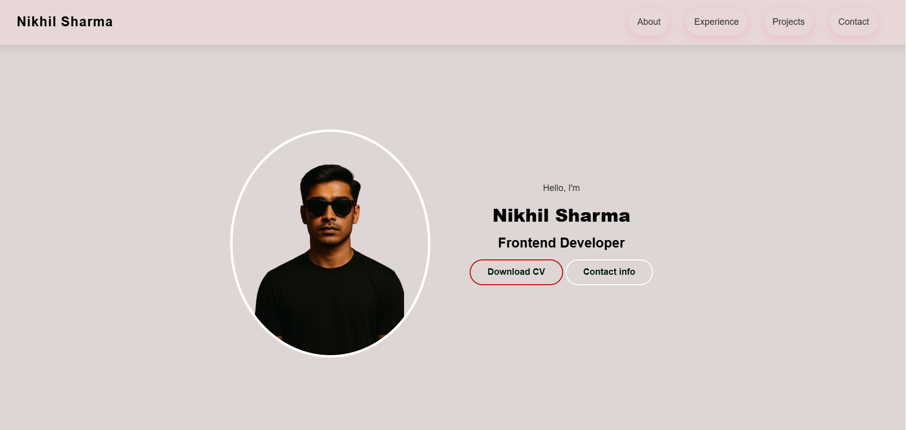

# My_Portfolio_
Professional  A modern and responsive personal portfolio website built with HTML, CSS, and JavaScript to showcase my skills, projects, and resume. 

# 🌟 Personal Portfolio Website - Nikhil Sharma

This is my **personal portfolio website** built using **HTML, CSS, and JavaScript**.  
It highlights my **skills, education, services, projects, and contact information** in a modern and responsive layout.

🔗 **Live Demo**: [Add GitHub Pages / Netlify / Vercel link here]

---

## 📸 Preview
  
*(Replace with an actual screenshot of your portfolio)*

---

## ✨ Features
- 🌐 Fully responsive design (desktop + mobile)
- 🎨 Custom background images (different for large and small screens)
- 📱 Mobile navigation with hamburger menu
- 👨‍💻 About section with skills, education, and experience
- 🛠 Services section with hover effects
- 💼 Portfolio section with project showcase + overlay details
- 📩 Contact form integrated with **Google Sheets**
- 📄 Resume download button
- ⚡ Smooth animations & hover effects

---

## 🛠️ Tech Stack
- **HTML5** – Structure
- **CSS3** – Styling & Responsiveness (Flexbox, Grid, Media Queries)
- **JavaScript (Vanilla JS)** – Menu toggle & form submission
- **Font Awesome** – Icons
- **Google Fonts** – Custom typography
- **Google Sheets API** – Contact form data storage

---

## 📂 Project Structure
Portfolio-Website/
│── index.html # Main HTML file
│── style.css # Styling (desktop + responsive)
│── script.js # JS for menu & contact form
│
├── assets/
│ ├── images/ # Backgrounds, profile & project images
│ │ ├── bg_image.png
│ │ ├── portrait_photo_bg.png
│ │ ├── prof-photo4.png
│ │ ├── my-work.png
│ │ ├── nik-portfolio-ui-ux-design.png
│ │ └── nik-project-netflixClone.png
│ └── cv/ # Resume
│ └── NikhilSharma_Resume.pdf


---

## 🚀 Getting Started

### 1. Clone Repository
```bash
git clone https://github.com/your-username/portfolio-website.git


# 🔮 Future Improvements

1. 🌗 Add Dark/Light Mode toggle
2. 🎞 Add scroll animations (GSAP / AOS.js)
3. 📰 Add a Blog Section for articles & updates
4. 🎤 Integrate a Testimonials Section
5. 📊 Add a Projects Dashboard with live demos & GitHub links
6. 🌍 Multi-language support (English/Hindi)

📬 Contact
Email: nikhil.sharma.870035@gmail.com
LinkedIn: linkedin.com/in/nikhil-sharma-b84213301
